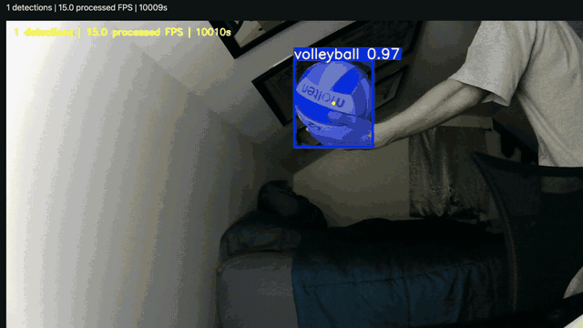
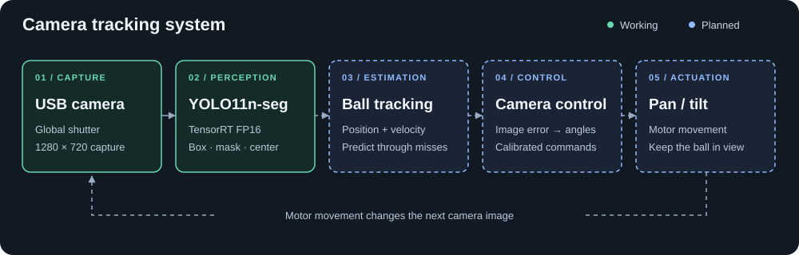

# Jetson Ball Tracking

**Building a camera that follows the volleyball.**

I trained YOLO11n-seg on my own footage and deployed it on a Jetson for live
detection and segmentation. Next is tracking the ball between frames and
controlling pan/tilt motors to keep it in view.

[](docs/media/jetson-demo.mp4)

**[Watch the full demo · 59 seconds](docs/media/jetson-demo.mp4)** — recorded
backyard inference, the hardware, then the live Jetson feed.

`Jetson Orin Nano` · `YOLO11n-seg` · `PyTorch` · `ONNX` · `TensorRT FP16` · `OpenCV` · `CVAT + SAM 2.1`

## What's working

**Training.** I labeled **644 keyframes from eight recordings** in CVAT with
SAM 2.1 Large assistance, covering different angles, lighting and backgrounds.
After removing two duplicates, I used **three-fold cross-validation**, keeping
each recording in one split per fold. The final model trained on **519 images**;
**123 images from a separate recording** were reserved for testing.

**Deployment.** I exported the PyTorch checkpoint to ONNX and built a TensorRT
FP16 engine on the Jetson. OpenCV reads the USB global-shutter camera; the model
predicts boxes, masks and confidence scores. A browser viewer displays them
with box-center markers. Each frame is processed without previous detections.

## TensorRT performance

Same checkpoint, Jetson Orin Nano in 25 W mode, batch 1, 640×640 input.

| Measured | PyTorch CUDA | TensorRT FP16 |
| :--- | ---: | ---: |
| Model call latency · mean | 24.72 ms | **4.92 ms** |
| Model calls / second | 40.46 | **203.39** |
| Video decode + prediction | 12.72 FPS | **17.66 FPS** |

TensorRT made model calls **5.03× faster** and video processing **1.39× faster**.
The model timing excludes preprocessing and postprocessing; video timing
includes both and decoding. The live camera application currently processes
**about 15 FPS**. I still need to determine why capture is delivering fewer
frames than the requested 30 FPS.

Held-out FP16 results: **94.93% box mAP50**, **86.4% precision / 90.0% recall**
at confidence 0.25 and box IoU ≥0.5. My priority is reducing detections of objects
that aren't the ball. Only three test images contain no ball, so I need more
examples to evaluate those errors.

[Benchmark protocol and conversion checks](deployment/README.md) ·
[Full deployment results](DEPLOYMENT_RESULTS.md) ·
[Training results](TRAINING_RESULTS.md)

## Where this is going



Next, I'll compare detections across frames to estimate where the ball is moving
and predict its position when the model briefly misses it. I'll use the ball's
offset from the image center to turn the camera toward it. The tracker must
also distinguish ball movement from changes caused by the camera turning.

| Stage | Work |
| :--- | :--- |
| **Done · detection** | Labeled dataset, model training and evaluation, TensorRT benchmarks, live demo. |
| **Now · accuracy and FPS** | Add Jetson-camera footage, reduce false detections, diagnose the ~15 FPS capture rate. |
| **Next · tracking** | Estimate ball movement between frames; predict through short misses and find the ball again after losing it. |
| **Then · pan/tilt** | Choose motors and a controller; calibrate how camera rotation changes the ball's position in the image. |
| **Later · testing** | Test the moving camera during backyard play, then in more indoor and outdoor conditions. |

Near-term perception targets: **30 FPS**, **p95 processing ≤33 ms**, and
**>99% precision** while retaining as much recall as possible. These are targets,
not achieved results. The controller and motor hardware are still open choices.

[Roadmap and milestone checks](ROADMAP.md) · [Exact perception targets](LIVE_REQUIREMENTS.md)

## Run the live demo

On the configured Jetson, with the custom engine and environment in place:

```bash
bash deployment/live.sh start
bash deployment/live.sh status
bash deployment/live.sh stop
```

[Camera setup](camera/README.md) · [Dataset](DATASET_PREPARATION.md) ·
[Training](TRAINING_PLAN.md) · [Deployment](deployment/README.md)

[Local connection settings](ops/README.md) are configured separately from the source.

Scripts currently target my lab setup. Datasets, checkpoints and raw benchmark
artifacts are kept outside Git.
